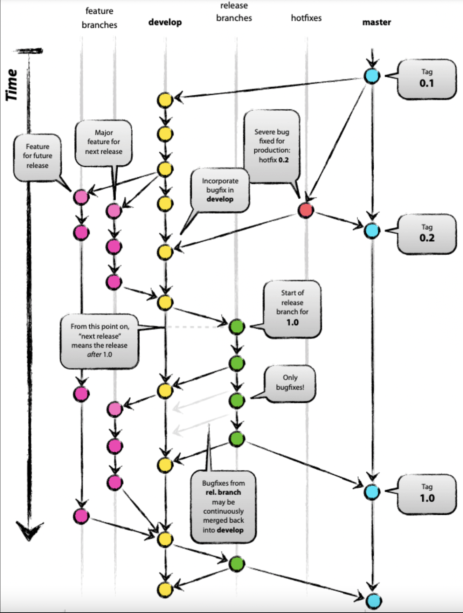
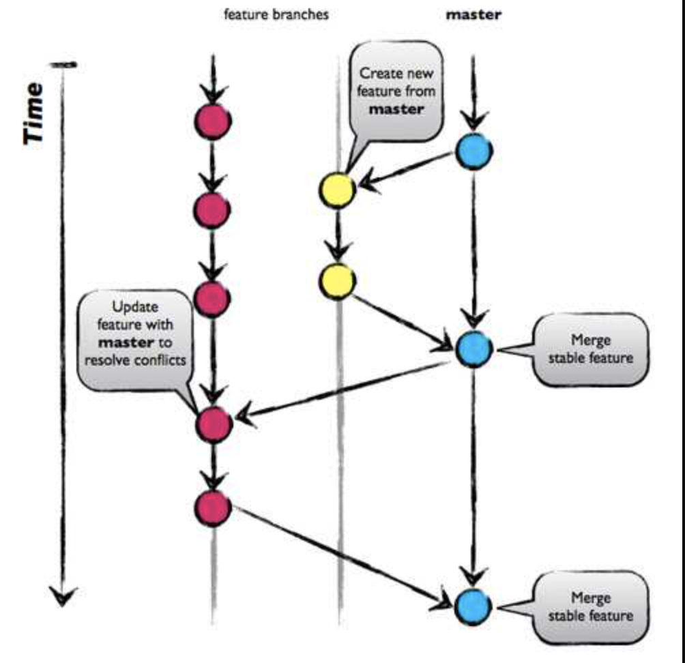
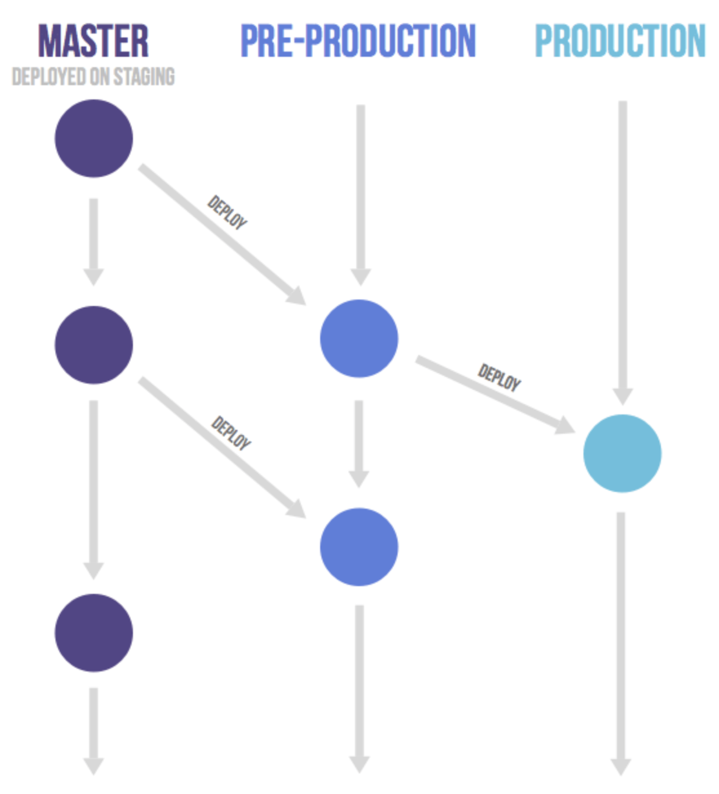
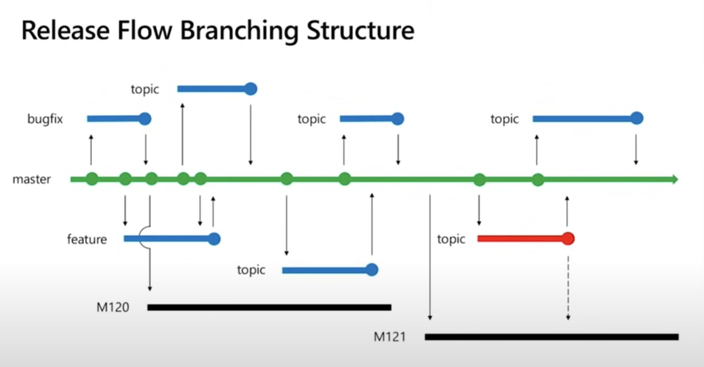
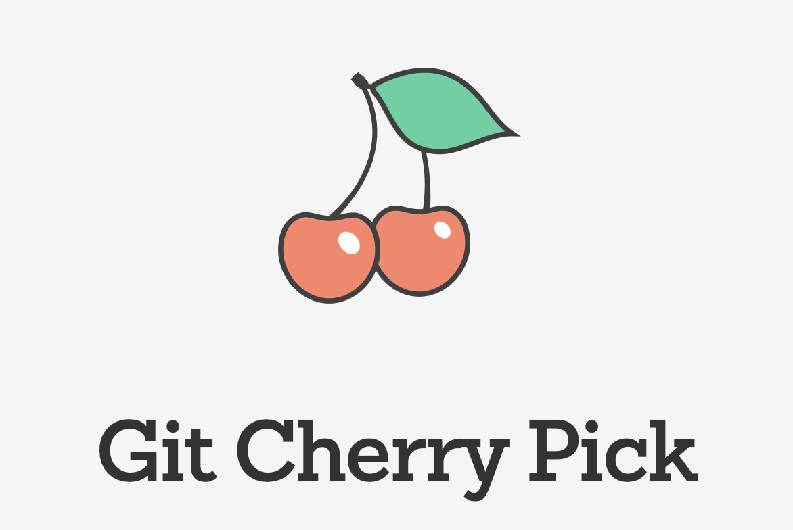

# Git Flow

## Table of Contents
- [Before we begin](#1-before-we-begin)
    - [Version control](#11-version-control)
    - [What is git](#12-what-is-git)
- [Git strategy](#git-strategy)
    - [GitFlow](#git-flow)

## 1. Before we begin

### 1.1 Version control
What is version control?

    Version control, also known as source control, is the practice of tracking and managing changes to software code.

Related declaration:

    Version control systems are software tools that help software teams manage changes to source code over time.

History of version control

<figure>

<figcaption align = "center"><b>Fig.1 - Local Version Control Systems</b></figcaption>
&emsp;
&emsp;

<figcaption align = "center"><b>Fig.2 - Centralized Version Control Systems</b></figcaption>
&emsp;
&emsp;

<figcaption align = "center"><b>Fig.3 - Distributed Version Control Systems</b></figcaption>
</figure>
&emsp;


### 1.2 What is Git

Git is a mature, actively maintained open source project originally developed in 2005 by Linus Torvalds ([REF](https://www.atlassian.com/git/tutorials/what-is-git>))


**Git mindset**

```
Git thinks of its data more like a series of snapshots of a miniature filesystem. With Git, every time you commit, or save the state of your project, Git basically takes a picture of what all your files look like at that moment and stores a reference to that snapshot. To be efficient, if files have not changed, Git doesn’t store the file again, just a link to the previous identical file it has already stored. Git thinks about its data more like a stream of snapshots.
```

<br /><br /><br />


&emsp;

&emsp;

&emsp;

## Git Strategy

[comment]: <> (__________________________ )
[comment]: <> (|                         |)
[comment]: <> (|        Git Flow         |)
[comment]: <> (|_________________________|)

### GitFlow
> https://www.flagship.io/git-branching-strategies/

#### ***What is it?***
This branching strategy consists of the following branches:

- Master
- Develop
- Feature: To develop new features that branches off the develop branch 
- Release: Help prepare a new production release; usually branched from the develop branch and must be merged back to both develop and master
- Hotfix: Also helps prepare for a release but unlike release branches, hotfix branches arise from a bug that has been discovered and must be resolved; it enables developers to keep working on their own changes on the develop branch while the bug is being fixed.

The main and develop branches are considered to be the main branches, with an infinite lifetime, while the rest are supporting branches that are meant to aid parallel development among developers, usually short-lived.

#### ***Visialize***


<figcaption align = "center"><b>Fig.4 - Git strategy 1: GitFlow</b></figcaption>

#### ***Pros & cons***
Pros
- Allows for parallel development to protect the production
- The various types of branches make it easier for developers to organize their work

Cons
- As more branches are added, they may become difficult to manage as developers merge their changes from the development branch to the main
    <details>
        <summary>Explain more</summary>
        
        Developers will first need to create the release branch then make sure any final work is also merged back into the development branch and then that release branch will need to be merged into the main branch.
        
    </details>
    &emsp;

- In the event that changes are tested and the test fails, it would become increasingly difficult to figure out where the issue is exactly as developers are lost in a sea of commits.
- Indeed, due to GitFlow’s complexity, it could slow down the development process and release cycle. In that sense, GitFlow is not an efficient approach for teams wanting to implement continuous integration and continuous delivery.
&emsp;

&emsp;

[comment]: <> (__________________________ )
[comment]: <> (|                         |)
[comment]: <> (|       Github Flow       |)
[comment]: <> (|_________________________|)
### **Github Flow**
#### ***What is it?***
GitHub Flow is a simpler alternative to GitFlow ideal for smaller teams as they don’t need to manage multiple versions.

#### ***Visualize***

<figcaption align = "center"><b>Fig.4 - Git strategy 1: Github Flow</b></figcaption>

&emsp;

Unlike GitFlow, this model doesn’t have release branches. You start off with the main branch then developers create branches, feature branches that stem directly from the master, to isolate their work which are then merged back into main. The feature branch is then deleted.

The main idea behind this model is keeping the master code in a constant deployable state and hence can support continuous integration and continuous delivery processes.

#### ***Pros & cons***
Pros:
- Github Flow focuses on Agile principles and so it is a fast and streamlined branching strategy with short production cycles and frequent releases.
- This strategy also allows for fast feedback loops so that teams can quickly identify issues and resolve them.
- Since there is no development branch as you are testing and automating changes to one branch which allows for quick and continuous deployment.
- This strategy is particularly suited for small teams and web applications and it is ideal when you need to maintain a single production version.

Cons:
- The lack of development branches makes this strategy more susceptible to bugs and so can lead to an unstable production code if branches are not properly tested before merging with the master-release preparation and bug fixes happen in this branch. The master branch, as a result, can become cluttered more easily as it serves as both a production and development branch.
- This model is more suited to small teams and hence, as teams grow merge conflicts can occur as everyone is merging to the same branch and there is a lack of transparency meaning developers cannot see what other developers are working on.

### GitLab Flow
#### ***What is it?***
GitLab Flow is a simpler alternative to GitFlow that combines feature-driven development and feature branching with issue tracking.

While GitHub Flow assumes that you can deploy into production whenever you merge a feature branch into the master, GitLab Flow seeks to resolve that issue by allowing the code to pass through internal environments before it reaches production, as seen in the image below.

#### ***Visualize***

<figcaption align = "center"><b>Fig.4 - Git strategy 1: Trunk-based development</b></figcaption>

&emsp;

[comment]: <> (__________________________ )
[comment]: <> (|                         |)
[comment]: <> (| Trunk-based development |)
[comment]: <> (|_________________________|)

### **Trunk-based development**

#### ***What is it?***

Trunk-based development is a branching strategy that in fact requires no branches but instead, developers integrate their changes into a shared trunk at least once a day. This shared trunk should be ready for release anytime.

The main idea behind this strategy is that developers make smaller changes more frequently and thus the goal is to limit long-lasting branches and avoid merge conflicts as all developers work on the same branch. In other words, developers commit directly into the trunk without the use of branches.


Trunk-based development (TBD) is a branching model for software development where developers merge every new feature, bug fix, or other code change to one central branch in the version control system. This branch is called “trunk”, “mainline”, or in Git, the “master branch”.


> https://www.split.io/glossary/trunk-based-development/

&emsp;

#### ***Visualize***

<figcaption align = "center"><b>Fig.4 - Git strategy 1: Trunk-based development</b></figcaption>

#### ***Pros & cons***
Pros:
- It enhances collaboration as developers have better visibility over what changes other developers are making as commits are made directly into the trunk without the need for branches.
- Trunk-based development paves the way for continuous integration as the trunk is kept constantly updated.

Cons:
- Because trunk-based development does not require branches, this eliminates the stress of long-lived branches and hence, merge conflicts or the so-called ‘merge hell’ as developers are pushing small changes much more often. This also makes it easier to resolve any conflicts that may arise.

## **How to choose the best branching strategy**

Great for open-source projects that require strict access control to changes. This is especially important as open-source projects allow anyone to contribute and so with Git Flow, you can check what is being introduced into the source code.

However, GitFlow, as previously mentioned, is not suitable when wanting to implement a DevOps environment. In this case, the other strategies discussed are a better fit for an Agile DevOps process and to support your CI and CD pipeline.

| Product type and its release method | Team size | Collaboration maturity | Applicable mainstream branch mode |
| ----------- | ----------- | ----------- | ----------- |
| All | Small team | High | Trunk-Based Development (TBD)|
| Products that support continuous deployment and release, such as SaaS products | Middle | Moderate | GitHub-Flow and TBD|
| Products with a definite release window and a periodic version release cadence, such as iOS apps | Middle | Moderate | Git-Flow and GitLab-Flow with release branch |
| Products that are demanding for product quality and support continuous deployment and release, such as basic platform products | Middle | Moderate | GitLab-Flow |
| Products that are demanding for product quality and have a long maintenance cycle for released versions, such as 2B basic platform products | Large | Moderate | Git-Flow |


#### **Note:**

master is the main branch. Contain all newest fixes and features.

The branch M120 is the production branch. Mean that if any release version of master branch can go live to production then the branch Mxxx can be started there.

With hot fix:

Hot fix will take the started point from the master branch. Where the Mxxx branch start. Then when the fix is finished. It will be merged into master branch. Then use cherry-pick to pick the fix code into the Mxxx branch.


///Create demo for this strategy




#### ***Cherry-pick definition***

`git cherry-pick` is a powerful command that enables arbitrary Git commits to be picked by reference and appended to the current working HEAD. Cherry picking is the act of picking a commit from a branch and applying it to another. `git cherry-pick` can be useful for undoing changes. For example, say a commit is accidently made to the wrong branch. You can switch to the correct branch and cherry-pick the commit to where it should belong.

> https://www.atlassian.com/git/tutorials/cherry-pick

&emsp;
## How to use `git cherry pick`
&emsp;

To demonstrate how to use `git cherry-pick` let us assume we have a repository with the following branch state:

    a - b - c - d   Main
         \
           e - f - g Feature

`git cherry-pick` usage is straight forward and can be executed like:

```
git cherry-pick commitSha
```

In this example `commitSha` is a commit reference. You can find a commit reference by using git log. In this example we have constructed lets say we wanted to use commit `f` in main. First we ensure that we are working on the main branch.
```
git checkout main
```
Then we execute the cherry-pick with the following command:
```
git cherry-pick f
```
Once executed our Git history will look like:

    a - b - c - d - f   Main
         \
           e - f - g Feature
The f commit has been successfully picked into the main branch

